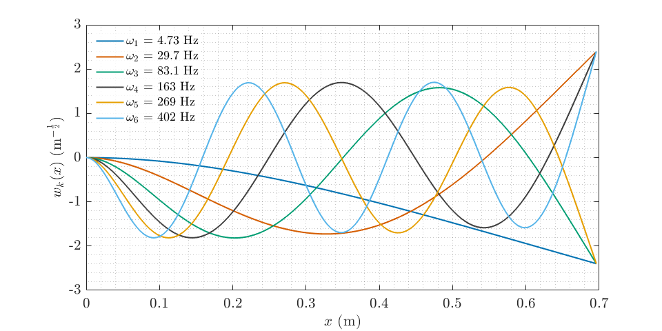

# UG Formatting Tips and Tricks
Repo constructed by tutors in the School of AMME and [ACFR](https://robotics.sydney.edu.au) at the [University of Sydney](https://sydney.edu.au) with tips and tricks for formatting of formal engineering reports and assignments.

Communication of ideas, results, and technical content clearly and effectively is integral to engineering. Getting into good habits before starting your undergraduate thesis or entering industry will help you explain your work to not only to those skilled in your field, but also those outside of it. Many of the semantics required for good formatting and communication can be "set-and-forget." For example, you can standardise your figures, tables, and presentation with nice formatting so that you can focus on getting the words right on the page.

Our intention for this repo is to give you an idea of best practice with regards to formatting so you can appreciate how the presentation of a document affects the clarity on the readers end.

## Contents
- [LaTeX](#LaTeX)
- [Font & Typeface](#Font)
- [Figures](#Figures)
- [Tables](#Tables)
- [Mathematics](#Mathematics)
- [Calculations](#Calculations)
- [Code](#Code)

## LaTeX
### Use it*
From about second year, your coursework will have some rigorous maths and will therefore require proper typesetting for clarity. For this reason you are strongly encouraged to use LaTeX for every document you produce. It is easier to manage large and long documents, takes the pain out of formatting pages of maths and ensures your document is formatted how you define it rather than how another program thinks it should be.

Why the asterisk? For quick things - Google Docs or a text file will do fine. If you're writing an essay and there is no maths and pictures, and it's less than 20 pages - traditional document software will do. For presentations, you can do your slides in LaTeX using the Beamer class but it's finicky as you have too many images and isn't as dynamic as say Powerpoint. Everything else (particularly your thesis!): LaTeX - you'll thank us later.

As far as we're concerned: if NASA uses it, and book publishers use it, and good academics use it, you should use it too.

### Resources
- [Overleaf](https://www.overleaf.com): the Google Docs of LaTeX. You also have a free Pro+ account with your USyd login waiting for you. If you don't need to have an offline LaTeX compiler, this is the best way to get started.
- [USYD Report Template for LaTeX](https://github.com/nackjaylor/USYDReport_Template): passed around since 2018. A good template for reports, assignments, problem sets etc. Customise it as you see fit.
- [An Intro to LaTeX](https://www.youtube.com/watch?v=NJEnvQmWVac): a brief intro to LaTeX showing what it can do, and why it's worthwhile learning along with how to get started. [You can find the slides here](https://nackjaylor.github.io/assets/AIAALaTeX2021.pdf).
- [TeXnique](https://texnique.xyz/): a nice game to familiarise/challenge yourself with typing maths in LaTeX and learning the symbols.

## Font & Typeface
Make it legible. Make it easy on the eyes (basic serif/sans serif fonts only). Choose your colours carefully. And please, we beg you: no comic sans.
### Resources
- [NASA Flightdeck Documentation](https://ti.arc.nasa.gov/m/profile/adegani/Flight-Deck_Documentation.pdf): Not all fonts and colours are easy to read. This is a really interesting resource to read in full about how engineering design interacts with human psychology. If you just want the crux of it, their list of recommendations at the end is what is really necessary.

## Figures

### Quality Figures
They say a picture speaks a thousand words, but they often forget the caveat: *only if it's nicely formatted!* Presenting your figures in a neat and concise manner is often the difference between someone understanding what you've done, and quickly zoning out. You can imagine how important this is if you are trying to explain some results to your boss or supervisor in a short meeting. A quality figure never subtracts from a report.

In the `matlab/` directory of this repository, you will find default plotting functions to help make your figures nice. At the start of every MATLAB session, we suggest you run `startup_plotting.m` to change the default color scheme and set label fonts to LaTeX. After creating a plot, you can run the `formatNice()` function to automatically change the font size and linewidth of all objects in the figure to a value of your choosing. This function will also set the plot background style.

### No Screenshots of Figures or Photos of Screens
As per the title - don't do it.

For inclusion in documents you should use a vector format like Encapsulated Post-Script (EPS) or PDF which will scale and not degrade with compression. Failing that, a .png at a high enough DPI is acceptable, though it can increase the size of your documents. MATLAB and Python both have these options natively.

### Presenting 3D Info

Remember that an image shows a projection of 3D space. The same way that cameras work, we lose an indication of scale and knowledge of unseen regions in this way. You therefore need to consider the 3D data you have. 

For some things like a point cloud or a mesh, maneuvring the camera so it sees as much of the 3D information as possible is a good start. This is data where the shape gives most of the information.

One way you can help a reader to understand the 3D data more is by providing more representations of it: for example, colouring points or a mesh by normals, providing coloured and uncoloured geometry and providing the same landscape from multiple different views. The last point here is probably the most important - for complex geometry, it is often necessary to see it from a view perspectives to appreciate its shape. Similar to engineering drawings, a top, front, side and isometric view can do a good job of helping to understand if you're struggling at picking your own perspectives.

For complex functions in 3D, sometimes presenting them in 3D is not the best choice at all! Presenting a 2D plot which a colourmap corresponding to the value of the 3rd axis is often just as good if not better. This is often preferred for visualising optimisation landscapes, or depth maps.

Some 3D data is volumetric, like hyperspectal cubes, visualising parameter space for bifurcations in dynamic systems, or configuration spaces for robotic arms. Here you need to be careful in how you present these. Presenting slices of the 3D data in the form of an image is a good way of helping people to understand what is going on inside a volume. Another good approach here is changing the opacity of data - this is especially useful when you have surfaces in 3D that are curved and have unique shapes. This means that denser data is visually more opaque, while sparser data is visually lighter.

### Insets
Sometimes, figures need to show small changes or features within a larger context. For example, showing crowds of people in a satellite photo which is at low resolution. Not all of the original image is useful, but it helps to give context. Unfortunately, small changes a really difficult to see - and so it is your job to make these as easy as possible to find.

Take for example this image taken from NASA's Ingenuity Helicopter:

  

If I just say this contains a photo of Perserverence from the air, you'd need to take a few moments to find him in there. What you can do as a neat trick is add an inset to the image, directing the readers eyes immediately magnifying the region you want them to look at. Is it easier to find Percy in this image?

### Captions
If you have an image it should have a caption which gives the reader some interpretation of what is presented to them. You should have selected the figure for a purpose, and therefore will have an understanding of what you think it adds to the main body of text. It doesn't have to (and shouldn't!) be paragraphs long, but a sentence or two of clear and direct description with a link to the main body is necessary.

Take the below for example:

Fig. Apollo 11 on the Moon.
  

vs.

Fig. Astronauts on the Apollo 11 Lunar mission used f/0.7 lenses to image both in low light within shadows and under direct illumination from the sun. The design of sensors for planetary rovers need to deal with similar extremes in unknown environments, which presents a key challenge for engineers.
  

  
### Titles/Axes
Every graph should have a title and an axis. Some images and results containing images should similarly have titles when comparing different methods or axes when referring to specific parts of an image, or when the image has a scale/known dimension.

The title and axes should be in keeping with the rest of your document: especially with font size and ideally with font type also. This means: small images, should still have appropriately sized titles/labels. Which of the below would you rather see in a book?

  

  

  

  
  Ensure your axes are scaled appropriately: for example, if there are large changes in magnitude, you may wish to use a logarithmic axis. Ensure that scaling of axes makes sense - if you have changes between measurements on the scale of centimeters, an axes measured in metres with a strange power multiplier is not appropriate.

### Graphs & Grids
Any graph should have gridlines presented - whether it be 2D or 3D. The shape of functions and the location of key points such as minima and maxima is critical to fields like optimisation, dynamical systems and machine learning. For this reason, make it easy on your reader by providing gridlines that their eyes can follow and use to immediately locate key points of interest.

Ensure that these grid lines are fine and not too dark, else they can confuse when you have several trends of data on the one plot. This is particularly important when trends end horizontal or vertical.

All graphs should have a legend if they display more than one trend line, or type of data.

### Tools & Resources
- [Matplotlib](https://matplotlib.org/): this is one you're likely very familiar with. We direct you to the [cheatsheets](https://matplotlib.org/cheatsheets/) and [tutorials](https://matplotlib.org/stable/tutorials/index) to achieve some of what we've spoken about above.
- [Seaborn](https://seaborn.pydata.org/): an alternative to Matplotlib which gives more statistic-like plots. More granular display over appearance.
- [Matplot++](https://github.com/alandefreitas/matplotplusplus): nice library for C++ users to get results without having to switch to a new language.
- [ggplot2](https://ggplot2.tidyverse.org/): do you remember that one course where they told you to use R and you decided it was a rubbish language? Well it is, except for the fact it has ggplot2 under the hood which is very nice. [ggplot stands for the "grammar of graphics"](https://cfss.uchicago.edu/notes/grammar-of-graphics/) which is a kind of language for making data clear and pleasant. There's versions of this for both Python and MATLAB that are worth looking into. 

## Tables

### Less is More
Some tables can be gross. Disgustingly gross. Some can be boring and very difficult to interpret. A good rule of thumb here is: less is more. The gif below gives the best example of this that I've seen, and better than a static example I can come up with.

This comes with a caveat: for most purposes I would follow this minimalist style as much as possible, except for when you a required to use a specific template or style of document (e.g. an IEEE Journal template). These will have examples for how the template should use a table. In this case - you must follow how the template has set it out. Everything else: make it pleasant, please.

### Tools

- [Excel2LaTeX](https://github.com/ivankokan/Excel2LaTeX): Format tables in Excel in terms of colours, bolding, alignment and then convert directly to LaTeX.

## Mathematics

### Functions Vs. Variables
As your notation gets more complex, you increasingly find yourself needing to use new variables. Someone reading your work therefore needs to quickly understand what the variables in each equation are. Functions are often denoted by several letters, and it can get very confusing which variables are variables and which are functions if you're lazy and don't distinguish them. Take the example below:

It is clear here what we mean - but it could be confusing if you use the letters "s", "i" and a function "n(x)" elsewhere in your manuscript. For this reason, any user defined functions (sign, heaviside, trigonometric functions, argmin/argmax etc.) or common functions (sin, cos, tan) should be positioned upright. This is as simple as adding a backslash before the command if the functions are found in a package. If not, you can define your own or use the `\mathrm{name}` command to remove the italics from the block.

This should only be done for functions whose names are more than one letter long, for example it is perfectly fine to denote the below:

### Precise Choice of Operators
Some operators don't mean what you think they mean. For example:

If you're still early in your studies, these look to be equivalent. In actuality, the first expression is often used to denote a convolution between A and b, the second a cross product and finally a matrix multiplication between A and b. It is very important that you make your notation clear and correct: choose your operators precisely and carefully, making note of what is standard in the field you're working in.

A good rule is to not use any operator for a multiplication (matrix or scalar). Ensure you check your notation thoroughly playing a mathematical [Devil's Advocate](https://en.wikipedia.org/wiki/Devil%27s_advocate) with each line of working.

### Helpful Packages and Resources

- [Matrix Cookbook](https://www.math.uwaterloo.ca/~hwolkowi/matrixcookbook.pdf): A great resource by the University of Waterloo. Format matrix expressions as in this book.
- [`physics` LaTeX Package](http://mirrors.ibiblio.org/CTAN/macros/latex/contrib/physics/physics.pdf): This wraps some common matrix expressions, derivatives etc. up in commands. Well worth using.

## Calculations

### Units
Units should be included for any quantity that has a physical meaning. The units should only be included on the last line of working with a final answer and not throughout. Similar to the discussion on functions above, it is a good idea to distinguish units from variables. You can do this by adding a space, and then using upright text after a final calculation (`\,\mathrm{units}` works okay).

A package highly recommended for this is the [siunitx package](https://mirror.aarnet.edu.au/pub/CTAN/macros/latex/contrib/siunitx/siunitx.pdf) where you can use pre-defined units (or units you've defined) to standardise the formatting. It also forces you to double check the dimensions of the final value by inputting the unit name.

### Evaluation & Substitution
This should go without saying but - only substitute at the last step. Working through a calculation with a mix of values and variables gets messy, particularly when you cancel things out.

You should not have any numbers (except coefficients) until the last 2 lines of working. The second last line can be one of 2 things: a calculator readout prior to rounding or a value substitution. Often, this is unnecessary: it merely shows where you calculation may have gone wrong. The final line should be the numeric answer with any units. 

## Code

### Screenshots of code/terminals
A no-go unless specifically asked for. This can cause issues because text is not machine readable and cannot go through plagiarism checking software. To someone reading it, there is little to no benefit as we don't know whether the code runs or how it fits into the broader picture. Instead, if you want to explain how you implemented some code you should do so mathematically or [use a pseudocode listing](https://www.overleaf.com/learn/latex/Algorithms).

### Code for Appendices
Any code you submit alongside a report should be included in an appendix, and should be formatted in a way which is easily readable. This means ensuring that the code is coloured corresponding to whether a line is comments or code, similar to how VSCode, MATLAB and other programming IDEs work (unless you're a maniac who writes Assembly/FORTRAN/C/C++ code in VIM).

This means you should spend some time tidying up your code for the appendix. Ideally - you shouldn't have to at all and your code is well formatted. Imagine you are working professionally and need to pass code to someone else: this is how you should document your code in the appendix of your report. The more informative your comments, variables etc. the easier it is to read.

The good news is: including your code in a report is not difficult and you can customise its display so it is neat, tidy and clear. [More details can be found here.](https://www.overleaf.com/learn/latex/Code_listing)

### Coding Style Resources

- [Google's Styleguides](https://google.github.io/styleguide/): You should aim to follow this as closely as possible in terms of the amount of comments you need and the quality of coding style.
- [The Good Research Code Book](https://goodresearch.dev/): You should also use this to help guide how you document your code and split it up. Research/academic code can be atrocious to read through - it's written by people who think things are easy/logical which are not. Format by this guide.
- [Cookiecutter for Project Templates](https://github.com/cookiecutter/cookiecutter): If you don't have your own project templates for C++/Python/C etc. this is a good way to get some existing templates which are more modern. Some of the old Google project templates for C++ are good too: [projects](https://code.google.com/archive/p/cpp-project-template/) and [libraries](https://code.google.com/archive/p/cpp-library-project-template/).
